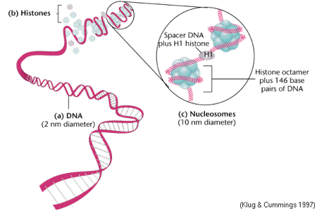

## What do we do

<div class="centered">

</div>

- Study the **molecular** basis of *variation* in development and disease
- Using **high-throughput** experimental methods

---

## The Genomic Revolution

- For over a decade we have laid the basic molecular blueprint by **sequencing** DNA

<div class="centered">

</div>

---

## The Genomic Revolution

<div class="centered">

</div>

build a **whole human genome** sequencing device and use it to sequence **100 human genomes** within **30 days or less**, with an accuracy of no more than one error in every 1,000,000 bases sequenced, with an accuracy rate of at least 98% of the genome, and at a recurring cost of **no more than $1,000 (US) per genome**.

---

## The Genomic Revolution

<div class="centered">

</div>

*“genome sequencing technology is plummeting in cost and increasing in speed independent of our competition”*

*“companies can do this for less than $5,000 per genome, in a few days or less — and 
are moving quickly towards the goals we set for the prize.”*

---

## The Genomic Revolution

**NHGRI strategic plan**

<div class="centered">

</div>

<footer class="source">[Nature, 2011]</footer>

---

## The Genomic Revolution

**NHGRI strategic plan**

"The major bottleneck in genome sequencing is no longer **data generation**—the computational challenges around **data analysis**, display and integration are now rate limiting. New approaches and methods are required to meet these challenges."

- Data analysis 
- Data integration
- **Visualization**
- Computational tools and infrastructure

<footer class="source">[Nature, 2011]</footer>

---

## What is Epigenomics?

What makes them different?

<div class="centered">

</div>

Much human variation is due to difference in ~ 6 million DNA base pairs (0.1 % of genome) 

---

## What is Epigenomics?

What makes them different?

<div class="centered">

</div>

Same genome is **expressed** differently during different **stages** and in different **tissues**.

---

## What is Epigenomics?

<div class="centered">

</div>

DNA is packed, making parts inaccessible, and this packing is **dynamic**!

---

## What is Epigenomics?

<div class="centered">


</div>

DNA methylation is a chemical modification of DNA, regulates *gene expression*.

<footer class="source">[Robertson and Wolffe, Nat Rev Genet, 2000]</footer>

---

## Our motivation

Measuring DNA methylation and understanding role in expression regulation in solid tumors

<div class="centered">

</div>

Large blocks of *hypo-methylation* (sometimes Mbps long) in colon cancer

- **Hansen, et al., *Nat. Genetics*, 2011**
- Corrada Bravo, et al., *BMC Bioinformatics*, 2012
- Timp, et al., *Genome Medicine*, 2014
- Dinalankara and Corrada Bravo, *Cancer Informatics*, in press.

---

## Our motivation

Measuring DNA methylation and understanding role in expression regulation in solid tumors
<div class="centered">

</div>

Genes with *hyper-variable* expression in colon cancer are enriched within these blocks.

- **Hansen, et al., *Nat. Genetics*, 2011**
- Corrada Bravo, et al., *BMC Bioinformatics*, 2012
- Timp, et al., *Genome Medicine*, 2014
- Dinalankara and Corrada Bravo, *Cancer Informatics*, in press.

---

## Our motivation

Measuring DNA methylation and understanding role in expression regulation in solid tumors
<div class="centered">


</div>

Genes with *consistent hyper-variable expression* across tumors are tissue-specific.

- Hansen, et al., *Nat. Genetics*, 2011
- **Corrada Bravo, et al., *BMC Bioinformatics*, 2012**
- Timp, et al., *Genome Medicine*, 2014
- Dinalankara and Corrada Bravo, *Cancer Informatics*, in press.

---

## Summary

- Large regions of hypo-methylation seems to be consistent in cancer
  - occur in pre-cancerous lesions
  - hypo-methylation increases with cancer progression
- Gene expression hyper-variability enriched within these regions
  - tissue-specific genes enriched within these regions
  - can use degree of deviation from normality as stable diagnosis and prognosis mark in multiple cancer types


---

## R/Bioconductor

<div class="centered">

</div>

- State-of-the-art computational and statistical analysis
platform
- We develop and apply methods for these analyses in this platform
- Our collaborators take part in analysis in this platform

---

## What we wanted

> - Data transformation and modeling: data smoothing, region finding (R/Bioconductor: `Bsmooth`, `minfi`)
> - Genome browsing: search by gene, search by overlap
> - Region analysis: overlap with other data (our own, other labs, UCSC, ensembl)
> - Regulation: expression data (Gene Expression Barcode)

--- 

## Genomic Data Science! 

- We have entered the era of data analysis
- Epigenomics roadmap, Encode, TCGA, ...
- *We have unprecedented ability to measure*
- *and lots of publicly available data to contextualize it*

<div class="centered">


<footer class="source">[H. Wickham]</footer>
</div>

---

<div class="centered">

</div>

### Integrative, visual and computational exploratory analysis of genomic data


Florin Chelaru, UMD

Chelaru, et al. Nature Methods, 2014.

[The old way](http://prezi.com/ddvaav72s_3k/?utm_campaign=share&utm_medium=copy&rc=ex0share)

---

<div class="centered">

</div>

### Integrative, visual and computational exploratory analysis of genomic data

- Browser-based
- Interactive
- Integration of data
- Reproducible dissemination
- Communication with R/Bioconductor: `epivizr` package

e.g.: http://epiviz.cbcb.umd.edu/2?ws=45KBV4C7z3u
<footer class="source">[Nat. Methods, 2014]</footer>

---

<iframe data-src="http://epiviz.cbcb.umd.edu/2/?ws=W3ieGz19icm" width="99%"></iframe>

---

## Communication with R/Bioc

Using the `epivizr` package

- Setup up an `epivizr` session

```r
mgr <- startEpiviz(workspace="qyOTB6vVnff")
```

- Add a device with data from analysis environment

```r
blocks_dev <- mgr$addDevice(colon_blocks, "450k blocks")
```

- Subset ranges by width

```r
keep <- width(colon_blocks) > 250000
mgr$updateDevice(blocks_dev, colon_blocks[keep,])
```

--- 

## Communication with R/Bioc

Using the `epivizr` package: browse by regions of interest.

- What's around the widest blocks?

```r
o <- order(-width(colon_blocks))
slideShowRegions <- colon_blocks[o[1:5],]
slideShowRegions <- slideShowRegions + 1e5
mgr$slideshow(slideShowRegions)
```

> `epivizr` uses WebSockets for connection, same as `shiny`. Big, big, big
> thanks to the @rstudio folks for working on this infrastructure.

---

## Plugins, plugins, plugins

Our architecture is *dynamically extensible*. We can easily integrate new data types and add new visualizations.

Example: adding a new visualization

see: https://gist.github.com/11017650

---

http://epiviz.cbcb.umd.edu/?gist[]=11017650&ws=Y8kWxCO2Ajn
<iframe data-src="http://epiviz.cbcb.umd.edu/2/?gist[]=11017650&ws=Y8kWxCO2Ajn"></iframe>

---
## Plugins, plugins, plugins

Example: import data from UCSC browser

see: https://gist.github.com/c41a2df3671395d8e4ad

---

http://epiviz.cbcb.umd.edu/?ws=cX1PgToUQs&seqName=chr11&start=59463945&end=60638081&gist[]=c41a2df3671395d8e4ad&settings=default&
<iframe data-src="http://epiviz.cbcb.umd.edu/2/?ws=cX1PgToUQs&seqName=chr11&start=59463945&end=60638081&gist[]=c41a2df3671395d8e4ad&settings=default&"></iframe>

---

## Plugins, plugins, plugins

<iframe data-src="http://epiviz.github.io"></iframe>

---

# Datatypes

<div class="centered">

</div>

- Based on classic "three-table" design in genomic data analysis
- **Data providers define coordinate space**

---

http://epiviz.cbcb.umd.edu/?ws=SRHZlWRRAPd&gist[]=a82a998817564ce3fe48&settings=default&
<iframe data-src="http://epiviz.cbcb.umd.edu/2/?ws=SRHZlWRRAPd&gist[]=a82a998817564ce3fe48&settings=default&"></iframe>

--- 

## Analysis era

<div class="centered">


<footer class="source">[H. Wickham]</footer>
</div>

One interpretation of *Big Data* is *Many relevant sources of contextual data*

- Easily access/integrate *contextual* data
- Driven by exploratory analysis of *immediate* data
- Iterative process
- Visual and computational exploration go hand in hand

---

## Visualization goals

- Context 
  - Integrate and align multiple data sources; navigate; search
  - *Connect*: brushing
  - *Encode*: map visualization properties to data on the fly
  - *Reconfigure*: multiple views of the same data

<footer class="source">[Perer & Shneiderman]</footer>

---

## Visualization goals

- Data
  - *Select and filter*: tight-knit integration with R/Bioconductor; 
  - (future) filters on visualization propagate to data environment
- Model
    - New 'measurements' the result of modeling; perhaps suggested by data context

<footer class="source">[Perer & Shneiderman]</footer>

---

## Creativity in exploration

We are building a software system to support creative exploratory analysis of epigenome-wide datasets...

<div class="centered">

</div>
<footer class="source">[T. Speed]</footer>

---

## Creativity in exploration

**Computed Measurements**: create new measurements from integrated measurements and visualize

<div class="centered">
<video width="320" height="240" controls>
  <source src="movies/computed.mp4" type="video/mp4">
Your browser does not support the video tag.
</video>
</div>

---

## Creativity in exploration

**Summarization on the fly**: create new measurements from integrated measurements and visualize

<div class="centered">
<video width="320" height="240" controls>
  <source src="movies/groupby.mp4" type="video/mp4">
Your browser does not support the video tag.
</video>
</div>

---

## What's next!

Beyond genomics and epigenomics: metagenomics

<div class="centered">

</div>

<footer class="source">[Human Microbiome Project]</footer>

---

## What's next!

Beyond genomics and epigenomics: metagenomics

**Coordinates**:

<div class="centered">

</div>

---

## What's next!

Beyond genomics and epigenomics: metagenomics

**Samples**:
<div class="centered">

</div>

---

## What's next!

Beyond genomics and epigenomics: metagenomics

<div class="centered">
<video width="320" height="240" controls>
  <source src="movies/metavizr1.mp4" type="video/mp4">
Your browser does not support the video tag.
</video>

</div>

---

## What's next!

Beyond genomics and epigenomics: metagenomics

<div class="centered">
<video width="320" height="240" controls>
  <source src="movies/metavizr2.mp4" type="video/mp4">
Your browser does not support the video tag.
</video>

</div>

---

## Acknowledgements


Florin Chelaru, UMD

- CBCB@UMD (Pop group)
- JHU/Harvard: Kasper Hansen, Winston Timp, Rafael Irizarry, Andy Feinberg
- Genentech: Michael Lawrence
- Rstudio: Joe Cheng, et al.
- Funding: NIH, Genentech

---

## Check it out:

- http://epiviz.github.io
- http://epiviz.cbcb.umd.edu
- http://github.com/epiviz

Nature Methods 2014    
Follow us: @epiviz  

These slides available: http://hcorrada.github.io/campusVis_201502

---


